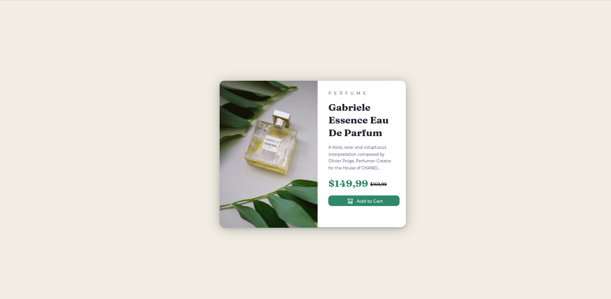

# Frontend Mentor - Product preview card component solution

This is a solution to the [Product preview card component challenge on Frontend Mentor](https://www.frontendmentor.io/challenges/product-preview-card-component-GO7UmttRfa). Frontend Mentor challenges help you improve your coding skills by building realistic projects. 

## Table of contents

  - [The challenge](#the-challenge)
  - [Screenshot](#screenshot)
  - [Links](#links)
  - [Built with](#built-with)
  - [What I learned](#what-i-learned)
  - [Continued development](#continued-development)
  - [Useful resources](#useful-resources)
- [Author](#author)

### The challenge

Users should be able to:

- View the optimal layout depending on their device's screen size
- See hover and focus states for interactive elements

### Screenshot




### Links

- Solution URL: [Add solution URL here](https://lucianamcustodio.github.io/FEMProductPreviewCard/)

### Built with

- Semantic HTML5 markup
- CSS custom properties
- Flexbox
- CSS Grid
- [Styled Components]
- Family: [Montserrat](https://fonts.google.com/specimen/Montserrat)
- Weights: 500, 700
- Family: [Fraunces](https://fonts.google.com/specimen/Fraunces)
- Weights: 700


### What I learned

O código desenvolvido foi comentado no maximo de locais para ser claro e objetivo.
Você poderá encontrar comentários tanto no HTML quanto no CSS, onde os mais importantes estão marcados.

```html
criando favicon:
</criando> <link rel="icon" type="image/png" sizes="32*32" href="images/favicon-32x32.png">
```
```css
criando shadow box:
    { box-shadow: rgb(14 30 37 / 12%) 0px 2px 4px 0px, rgb(14 30 37 / 32%) 0px 2px 16px 0px;
 
}
```

### Continued development
Acredito que o ganho foi excelente no desenvolvimento desse layout, que me custou bastante tempo e não está responsivo o suficiente, mas é o primeiro que faço.
Então creio que no próximo será muito mais rápido.
É tudo questão de começar.

### Useful resources

- [Botões](https://www.w3bai.com/pt/css/css3_buttons.html#gsc.tab=0) - Isso me auxiliou na estilização da transição dos botões. vale muito a pena.
- [Conversos de cores para Hexa](https://convertingcolors.com/hsl-color-158_10_40.html) - Conversor de cores.
- [Box Shadow](https://codepen.io/sdthornton/pen/wBZdXq) - Criados de box Shadow

## Author

- GitHub - [Add your name here](https://github.com/Lucianamcustodio)
- Frontend Mentor - [@lucianamcustodio](https://www.frontendmentor.io/profile/yourusername)
- Linkedin - [Luciana Moreira Custódio](https://www.linkedin.com/in/lucianamcustodio/)

**Note: Delete this note and add/remove/edit lines above based on what links you'd like to share.**
